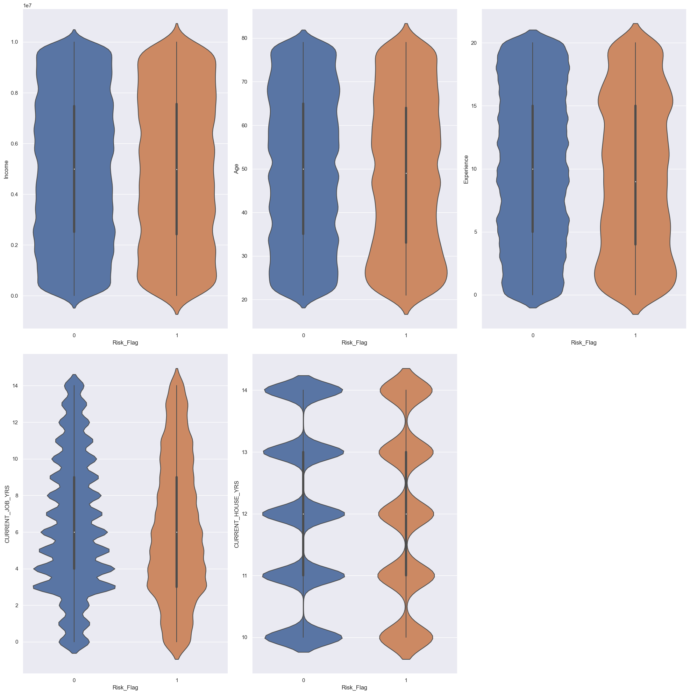
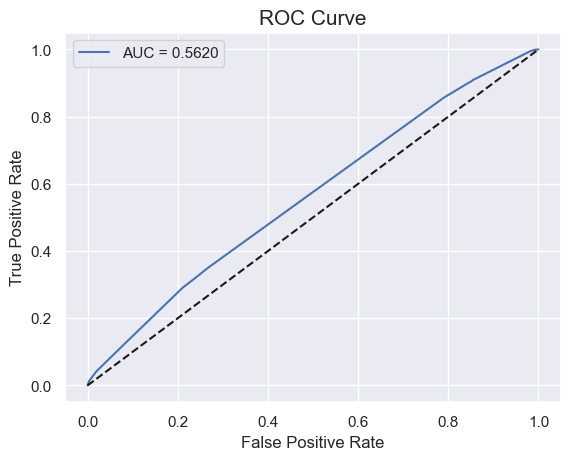
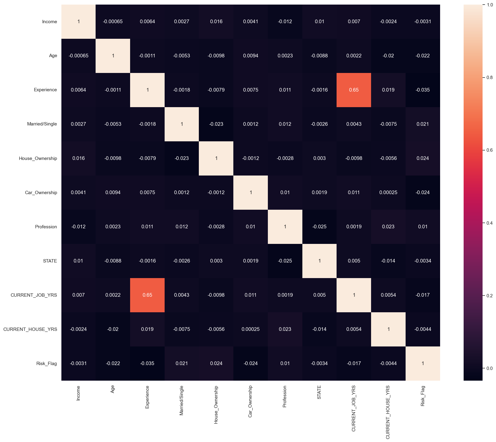
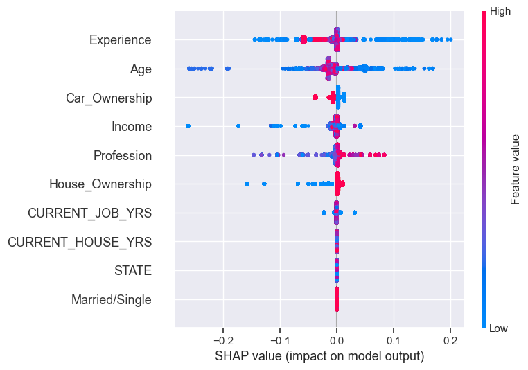
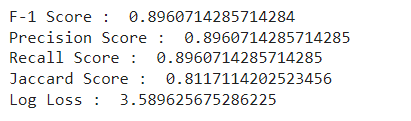

# Loan-Prediction-Based-on-Customer-Behavior

This project implements a machine learning model to predict loan approval based on customer behavior and characteristics.

## Project Overview

The goal of this project is to develop a predictive model that can determine whether a loan application should be approved or rejected based on various customer attributes. The model uses historical data to learn patterns and make predictions on new loan applications.

## Dataset
The dataset used in this project contains the following features:
- Income
- Age
- Experience
- Married/Single
- House_Ownership
- Car_Ownership
- Profession
- City
- State
- Current_Job_Years
- Current_House_Years
- Risk_Flag (target variable)

## Requirements
To run this project, you'll need the following libraries:
- pandas
- numpy
- matplotlib
- seaborn
- scikit-learn
You can install these libraries using pip:
```bash
pip install pandas numpy matplotlib seaborn scikit-learn
```

## Project Structure

The project is structured as follows:

- Data Loading and Exploration
- Data Preprocessing
- Handling missing values
- Encoding categorical variables
- Feature scaling
- Model Development
- Splitting the data into training and testing sets
- Training and evaluating multiple models:
- Logistic Regression
- Random Forest
- XGBoost
- Model Evaluation
- Comparing model performance using accuracy scores
- Generating confusion matrices and classification reports

## Usage
To use this project:

Ensure you have all the required libraries installed.
Open the Jupyter notebook Loan_Prediction_Based_on_Customer_Behavior.ipynb.
Run the cells in order to load the data, preprocess it, train the models, and evaluate their performance.

## Results
The project compares the performance of three different models:

Achieved `89.61%`prediction accuracy in loan risk assessment using Decision Tree and Random Forest models to
evaluate borrower creditworthiness and mitigate default risk.

### Violin Plot


### ROC Curve


### Correlation Heat MAP


### SHAP Values



### Accuracy Results



